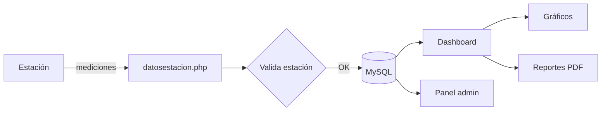

<p align="center">
  
</p>

<p align="center">
  
  
  
  
</p>

## Qué es ClimateCatcher

ClimateCatcher es un proyecto de **estación meteorológica + aplicación web**.

La estación toma mediciones del ambiente y las manda al servidor. La web guarda esos registros y permite verlos de una forma más cómoda: valores actuales, mínimos, máximos, promedios, gráficos e historial.

La idea era poder seguir el dato desde que sale de la estación hasta que aparece en pantalla.

## Qué mide

| Dato | Unidad |
| --- | --- |
| Temperatura | °C |
| Humedad | % |
| Luminosidad | % |
| Presión atmosférica | hPa |

## Qué se puede hacer

- recibir datos enviados por una estación;
- validar el código de la estación;
- guardar las mediciones en MySQL;
- registrar usuarios e iniciar sesión;
- asociar usuarios con estaciones;
- consultar valores actuales y estadísticas;
- ver el historial en gráficos con **Chart.js**;
- filtrar registros por fecha;
- descargar reportes en PDF;
- administrar usuarios y estaciones desde un panel separado.

## Cómo funciona



El recorrido es bastante directo:

1. La estación envía temperatura, humedad, luminosidad y presión.
2. `datosestacion.php` recibe los valores y comprueba la estación.
3. `insertardatos.php` guarda la medición con fecha y hora.
4. El dashboard consulta esos datos y calcula estadísticas.
5. Chart.js los muestra en gráficos.
6. Si hace falta, se puede generar un reporte PDF.

## Tecnologías

**Backend**
- PHP
- PDO
- MySQL
- FPDF

**Frontend**
- HTML
- CSS
- JavaScript
- Chart.js

## Archivos principales

```text
ClimateCatcher/
├── assets/                 # Recursos usados en el README
├── css/                    # Estilos de las distintas vistas
├── imagen/                 # Imágenes y recursos del proyecto
├── conexion.php            # Conexión a MySQL
├── datosestacion.php       # Recibe las mediciones
├── insertardatos.php       # Guarda los datos
├── dashboard.php           # Panel del usuario
├── dashboard_admin.php     # Panel de administración
├── generar_reporte.php     # Genera reportes PDF
├── login.php
├── login_admin.php
├── registro.php
├── logout.php
├── producto.php
├── index.html
├── scripts.js
├── styles.css
├── .env.example
├── SECURITY.md
└── docs/
    └── ARCHITECTURE.md
```

## Ejecutarlo de forma local

Hace falta tener:

- PHP 8 o superior;
- MySQL o MariaDB;
- Apache, XAMPP o un servidor similar.

La conexión a la base de datos usa variables de entorno:

```bash
DB_HOST=localhost
DB_NAME=climatecatcher
DB_USER=usuario
DB_PASSWORD=contraseña
```

El archivo `.env.example` sirve como referencia para saber qué valores hay que configurar.

## Envío de datos

Las mediciones llegan al endpoint con los datos de la estación:

```text
datosestacion.php?api_key=ESTACION&humidity=...&temperature=...&luminosity=...&pressure=...
```

El servidor valida la estación y responde en JSON.

## Seguridad

Las credenciales de la base de datos ya no están escritas dentro del código. Para una versión nueva del proyecto también habría que mejorar algunos puntos de la implementación original, sobre todo el manejo de contraseñas y la autenticación de las estaciones.

Dejé esos puntos anotados en [SECURITY.md](SECURITY.md).

## Documentación

En [docs/ARCHITECTURE.md](docs/ARCHITECTURE.md) está explicada la estructura interna con un poco más de detalle.
