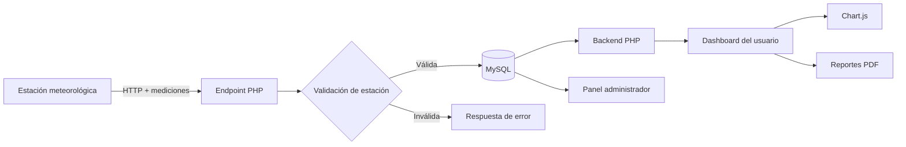

# ClimateCatcher

<p align="center">
  
</p>

<p align="center">
  Plataforma web para adquisición, almacenamiento, visualización y análisis de datos meteorológicos provenientes de una estación física.
</p>

<p align="center">
  
  
  
  
  
  
</p>

## Descripción

**ClimateCatcher** es un prototipo de sistema meteorológico compuesto por una estación física y una aplicación web. La estación envía mediciones ambientales a un backend desarrollado en PHP; los datos se validan, se almacenan en MySQL y luego pueden consultarse desde un panel web con estadísticas, gráficos, historial y generación de reportes.

El proyecto integra adquisición de datos, persistencia, autenticación, visualización y administración en una misma solución. Fue pensado como una demostración completa del recorrido de la información: desde el dispositivo que mide el ambiente hasta la interfaz donde el usuario interpreta los resultados.

## Variables meteorológicas registradas

El sistema trabaja con cuatro magnitudes principales:

| Variable | Descripción | Unidad mostrada |
| --- | --- | --- |
| Temperatura | Temperatura ambiente registrada por la estación | °C |
| Humedad | Humedad relativa del ambiente | % |
| Luminosidad | Nivel de iluminación recibido | % |
| Presión atmosférica | Presión registrada por el sensor | hPa |

## Funcionalidades principales

- Recepción de datos desde estaciones mediante un endpoint HTTP.
- Validación de una clave asociada a cada estación.
- Persistencia de mediciones en una base de datos MySQL.
- Registro e inicio de sesión de usuarios.
- Asociación entre usuarios y estaciones meteorológicas.
- Panel de usuario con valores actuales, mínimos, máximos y promedios.
- Visualización histórica mediante gráficos con **Chart.js**.
- Tabla paginada de mediciones.
- Filtrado y consulta de información por fecha.
- Generación de reportes descargables en **PDF** mediante FPDF.
- Panel de administración para consultar usuarios y estaciones.
- Gestión de sesión y cierre de sesión.

## Arquitectura



### Flujo de datos

1. La estación obtiene temperatura, humedad, luminosidad y presión.
2. El dispositivo envía los valores al endpoint `datosestacion.php`.
3. El backend verifica el identificador de la estación.
4. `insertardatos.php` registra la medición con fecha y hora.
5. El dashboard consulta los datos almacenados.
6. PHP calcula estadísticas y entrega la información a la interfaz.
7. Chart.js representa las series meteorológicas.
8. El usuario puede consultar el historial y generar un reporte PDF.

## Stack tecnológico

### Backend
- **PHP**: lógica del servidor, sesiones, autenticación, consultas y endpoints.
- **PDO**: acceso parametrizado a la base de datos.
- **MySQL**: almacenamiento de usuarios, estaciones y mediciones.
- **FPDF**: generación de reportes PDF.

### Frontend
- **HTML5**: estructura de las vistas.
- **CSS3**: diseño y presentación.
- **JavaScript**: comportamiento de la interfaz.
- **Chart.js**: representación gráfica de los datos.

### Conceptos implementados
- Aplicación web full-stack.
- Integración dispositivo-servidor.
- Endpoint de recepción de datos.
- Persistencia relacional.
- Consultas preparadas.
- Sesiones de usuario.
- Dashboard y visualización de datos.
- Generación de documentos.
- Separación entre interfaz de usuario y administración.

## Estructura del proyecto

```text
ClimateCatcher/
├── css/                    # Estilos específicos de cada vista
├── imagen/                 # Recursos gráficos y branding
├── conexion.php            # Conexión centralizada a MySQL
├── datosestacion.php       # Endpoint que recibe las mediciones
├── insertardatos.php       # Persistencia de datos meteorológicos
├── dashboard.php           # Panel principal del usuario
├── dashboard_admin.php     # Panel de administración
├── generar_reporte.php     # Exportación de datos a PDF
├── login.php               # Inicio de sesión
├── login_admin.php         # Acceso administrativo
├── registro.php            # Registro y asociación de estaciones
├── logout.php              # Cierre de sesión
├── producto.php            # Presentación del producto
├── index.html              # Página principal
├── scripts.js              # Interacciones del frontend
├── styles.css              # Estilos globales
├── .env.example            # Variables necesarias para la conexión
├── .gitignore              # Archivos excluidos del repositorio
└── docs/
    └── ARCHITECTURE.md     # Documentación técnica ampliada
```

## Ejecución local

### Requisitos

- PHP 8.x
- MySQL o MariaDB
- Servidor web local, por ejemplo Apache/XAMPP
- Navegador moderno

### Configuración

La versión de portfolio utiliza variables de entorno para evitar credenciales embebidas en el código.

```bash
DB_HOST=localhost
DB_NAME=climatecatcher
DB_USER=usuario
DB_PASSWORD=contraseña
```

Podés tomar `.env.example` como referencia. El servidor PHP debe exponer esas variables al proceso que ejecuta la aplicación.

Luego:

1. Configurar la base de datos y las tablas requeridas.
2. Copiar el proyecto dentro del directorio público del servidor.
3. Configurar las variables de entorno.
4. Abrir `index.html` desde el servidor local.
5. Registrar una estación y comenzar a recibir mediciones.

## Endpoint de mediciones

El proyecto recibe datos mediante una solicitud HTTP con los parámetros de la estación y sus lecturas:

```text
datosestacion.php?api_key=ESTACION&humidity=...&temperature=...&luminosity=...&pressure=...
```

El backend valida los valores, comprueba la estación y devuelve una respuesta JSON.

> En una evolución de producción sería recomendable migrar este envío a HTTPS + POST con autenticación específica para dispositivos.

## Seguridad

La versión de portfolio evita almacenar credenciales de base de datos dentro del repositorio. Los datos sensibles deben administrarse mediante variables de entorno y nunca incorporarse a Git.

También es recomendable, para una evolución del prototipo:

- almacenar contraseñas de usuario mediante hashes seguros;
- separar el código de estación de las credenciales de acceso;
- validar rangos físicos de cada sensor;
- utilizar HTTPS;
- limitar solicitudes al endpoint;
- implementar tokens revocables para dispositivos;
- registrar errores fuera del repositorio.

## Estado del proyecto

ClimateCatcher representa un **prototipo funcional full-stack e IoT**. El repositorio conserva la implementación original como parte del proceso de aprendizaje y esta rama organiza su documentación y configuración para presentarlo como proyecto de portfolio.

## Documentación técnica

Para una explicación más profunda de componentes, responsabilidades y flujo interno:

[Ver arquitectura técnica](docs/ARCHITECTURE.md)

---

**Autor:** [alejoesp](https://github.com/alejoesp)
